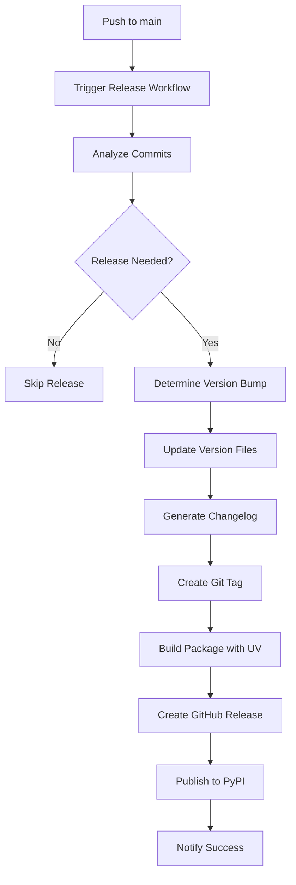

# Design Document - Automated Release Process

## Overview

The automated release process will be implemented using GitHub Actions workflows that integrate with UV for Python package management, semantic versioning tools, and GitHub's release API. The system will use conventional commits to determine release types and automatically handle the entire release pipeline from version bumping to package publishing.

## Architecture

### High-Level Flow



### Workflow Architecture

The system consists of three main GitHub Actions workflows:

1. **Release Workflow** (`.github/workflows/release.yml`) - Main automated release pipeline
2. **Manual Release Workflow** (`.github/workflows/manual-release.yml`) - Manual trigger capability
3. **Build Validation Workflow** (`.github/workflows/validate-build.yml`) - Pre-release validation

## Components and Interfaces

### 1. Release Please Action Component

**Purpose:** Automatically analyze commits, create release PRs, and manage the entire release lifecycle using Google's release-please-action.

**Implementation:**

- Uses `googleapis/release-please-action@v4` with Python release type
- Automatically parses conventional commit messages
- Creates release PRs with version bumps and changelog generation
- Triggers actual releases when release PRs are merged

**Key Features:**

- Supports `pyproject.toml` and `__init__.py` version management
- Automatic changelog generation from conventional commits
- Creates GitHub releases with proper tags
- Handles semantic versioning automatically

**Outputs:**

```yaml
outputs:
  release_created: boolean
  tag_name: string
  version: string
  upload_url: string
```

### 2. Version Management Component

**Purpose:** Automatically managed by release-please for Python projects.

**Implementation:**

- Release-please automatically updates version files for Python projects
- Supports `pyproject.toml` version field (primary)
- Supports `__init__.py` `__version__` variable (secondary)
- Can handle additional version files via `extra-files` configuration

**Supported Files:**

- `pyproject.toml` (version field) - Primary version source
- `src/package/__init__.py` (__version__ variable)
- Custom files via `extra-files` configuration in release-please-config.json

### 3. Build Component

**Purpose:** Build Python packages using UV for distribution.

**Implementation:**

- Uses UV for dependency management and building
- Creates both wheel and source distributions
- Validates package integrity before release

**UV Commands:**

```bash
uv build --wheel --sdist
uv publish --token $PYPI_TOKEN
```

### 4. Release Creation Component

**Purpose:** Create GitHub releases with proper tags and release notes.

**Implementation:**

- Uses GitHub CLI or Actions API
- Creates annotated Git tags
- Uploads build artifacts to release
- Sets release notes from generated changelog

### 5. Notification Component

**Purpose:** Notify stakeholders of release status.

**Implementation:**

- GitHub commit status updates
- Optional Slack/Discord webhooks
- Email notifications for failures

## Data Models

### Release Please Configuration

```json
// .release-please-config.json
{
  "release-type": "python",
  "packages": {
    ".": {
      "package-name": "your-package-name",
      "changelog-path": "CHANGELOG.md"
    }
  },
  "changelog-sections": [
    { "type": "feat", "section": "Features" },
    { "type": "fix", "section": "Bug Fixes" },
    { "type": "perf", "section": "Performance Improvements" },
    { "type": "docs", "section": "Documentation" },
    { "type": "refactor", "section": "Code Refactoring" },
    { "type": "test", "section": "Tests" },
    { "type": "chore", "section": "Miscellaneous Chores" }
  ]
}
```

```json
// .release-please-manifest.json
{
  ".": "0.1.0"
}
```

### Release Please Outputs

```yaml
# Available outputs from release-please-action
release_please_outputs:
  release_created: "true"  # Boolean indicating if a release was created
  tag_name: "v1.3.0"      # The tag name of the release
  version: "1.3.0"        # The version number (without 'v' prefix)
  upload_url: "https://uploads.github.com/..."  # URL for uploading assets
  
# Build artifacts structure
artifacts:
  - "dist/package-1.3.0-py3-none-any.whl"
  - "dist/package-1.3.0.tar.gz"
```

## Error Handling

### Failure Scenarios and Recovery

1. **Version Bump Conflicts**

   - Detection: Check for uncommitted changes before version update
   - Recovery: Stash changes, apply version bump, restore if needed
2. **Build Failures**

   - Detection: UV build command exit codes
   - Recovery: Rollback version changes, notify maintainers
3. **PyPI Publishing Failures**

   - Detection: UV publish command failures
   - Recovery: Create GitHub release without PyPI publication, manual retry option
4. **Network/API Failures**

   - Detection: HTTP error codes from GitHub/PyPI APIs
   - Recovery: Exponential backoff retry mechanism (3 attempts)

### Rollback Strategy

```yaml
rollback_steps:
  - name: "Delete created tag"
    condition: "tag_created && release_failed"
  - name: "Revert version commits"
    condition: "version_updated && build_failed"
  - name: "Delete draft release"
    condition: "release_created && publish_failed"
```

## Testing Strategy

### Pre-Release Validation

1. **Syntax and Type Checking**

   - Run `mypy` and `ruff` on all code
   - Validate `pyproject.toml` syntax
2. **Build Testing**

   - Test UV build process in isolated environment
   - Validate package metadata and dependencies
3. **Integration Testing**

   - Test workflow on feature branches (dry-run mode)
   - Validate changelog generation with sample commits

### Release Testing

1. **Staging Releases**

   - Use TestPyPI for package publishing tests
   - Create draft releases for validation
2. **End-to-End Testing**

   - Full workflow testing on dedicated test repository
   - Automated testing of manual release triggers

## Security Considerations

### Authentication and Authorization

1. **GitHub Token Permissions**

   - Minimal required permissions: `contents:write`, `packages:write`
   - Use GitHub's OIDC provider for secure authentication
2. **PyPI Publishing**

   - Use API tokens stored as GitHub secrets
   - Consider using Trusted Publishers (OIDC) for PyPI
3. **Workflow Security**

   - Restrict workflow execution to main branch only
   - Validate commit signatures where possible
   - Use pinned action versions with SHA hashes

### Secrets Management

```yaml
secrets:
  PYPI_API_TOKEN: # PyPI publishing token
  GITHUB_TOKEN: # Automatically provided by GitHub
  SLACK_WEBHOOK: # Optional notification webhook
```

## Performance Considerations

### Optimization Strategies

1. **Caching**

   - Cache UV dependencies between workflow runs
   - Cache build artifacts for faster rebuilds
2. **Parallel Execution**

   - Run validation checks in parallel with build process
   - Concurrent changelog generation and artifact preparation
3. **Resource Limits**

   - Target workflow completion under 5 minutes
   - Use appropriate GitHub runner sizes


## Implementation Phases

### Phase 1: Core Automation

- Basic release workflow with version bumping
- UV integration for building and publishing
- GitHub release creation

### Phase 2: Enhanced Features

- Changelog generation from conventional commits
- Manual release triggers
- Comprehensive error handling
